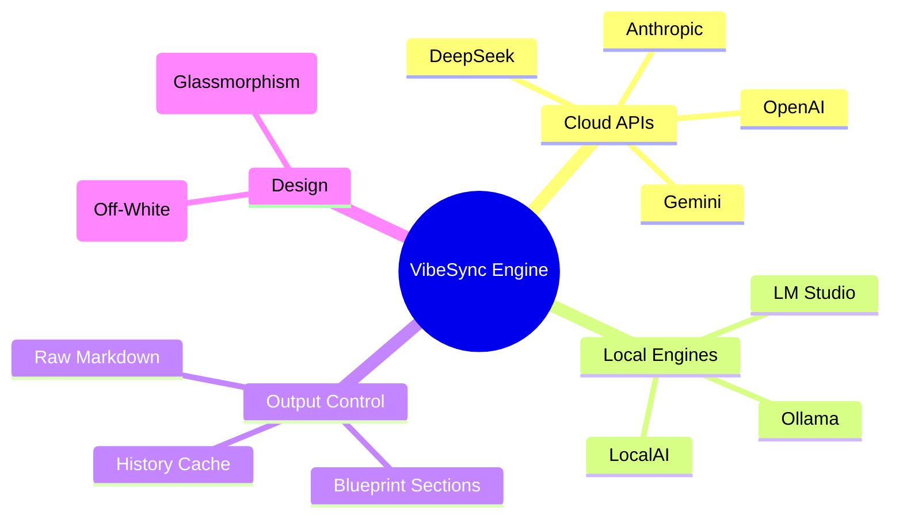
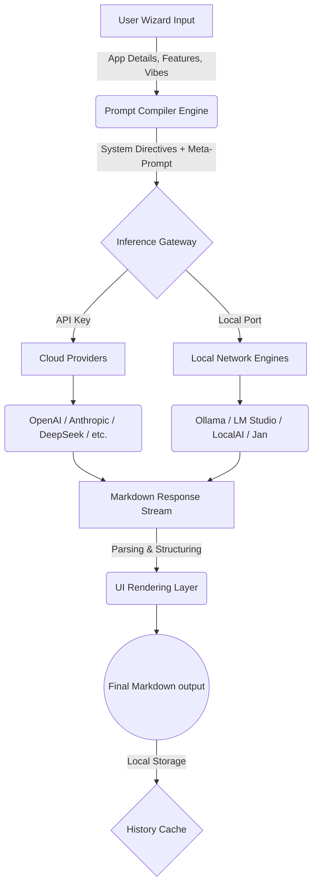
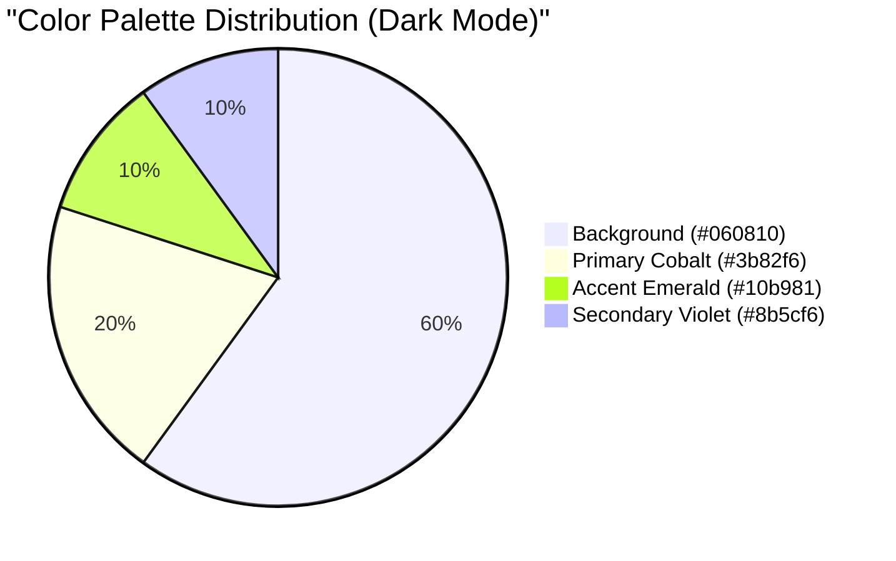

<div align="center">
  
  <h1>VibeSync</h1>
  <p><strong>Intelligent Prompt Generator for AI-Powered Creations</strong></p>
  <p>
    
    
    
  </p>
</div>

---

## 🚀 Overview

**VibeSync** is a hyper-advanced, web-based intelligence hub designed specifically to generate god-level, highly structured project prompts for AI coding agents like **Cursor**, **Bolt.new**, **Windsurf**, and **v0**.

Built entirely offline-first with zero-knowledge, local storage architecture, VibeSync connects seamlessly to **16+ Cloud AI Providers** (OpenAI, Anthropic, Gemini, DeepSeek, etc.) AND seamlessly bridges directly to **Local HTTP AI engines** like Ollama, LM Studio, Jan, and LocalAI.

Never write a prompt from scratch again.

---

## 🧠 Configure Your AI Hub (The Intelligence Core)

VibeSync features a state-of-the-art "AI Hub" that allows you to swap brains instantly. We support over 16+ providers across two categories:

### ☁️ Cloud AI Providers (API Key Required)
| Provider | Key Models | Best For |
| :--- | :--- | :--- |
| **Anthropic** | Claude 3.5 Sonnet, Opus | Complex coding & reasoning |
| **OpenAI** | GPT-4o, o1-preview | Versatility & popular ecosystem |
| **DeepSeek** | DeepSeek V3, R1 | Elite logic, math & code |
| **Google Gemini** | 1.5 Pro, Flash | Massive 2M+ context window |
| **Groq** | Llama 3.3, Mixtral | Blazing fast inference (800+ t/s) |
| **OpenRouter** | 500+ models | Unified access to all AI |
| **xAI (Grok)** | Grok-2 | Real-time X integration |
| **Mistral** | Mistral Large | Leading open-weight cloud |

---

### 🏠 Local AI Engines (100% Free & Private)
Run models locally with zero data leaving your machine. Ideal for private projects.

#### 🦙 Ollama
- **Default Port**: `11434`
- **Setup**: `ollama serve` -> Connect `http://localhost:11434/v1/chat/completions`
- **Models**: Llama 3.2, Mistral, Gemma 2, Phi-3.

#### 🖥️ LM Studio
- **Default Port**: `1234`
- **Setup**: Start "Local Server" tab -> No API key needed.
- **Models**: Supports any GGUF model via `llama.cpp`.

#### 🤖 Jan / LocalAI
- **Ports**: `1337` / `8080`
- **Setup**: Open-source ChatGPT alternatives. Connect via OpenAI-compatible endpoints.

---

## 🛠️ Advanced Generation Features

- **Master Prompt Mode**: Generates a single, massive objective-driven prompt.
- **Step-by-Step Mode**: Breaks your project into actionable development phases.
- **Full PRD**: A deep Product Requirements Document with User Stories and Technical Specs.
- **Component List**: Automatic breakdown of every UI/Backend component needed.



---

## 🏗️ System Architecture & Workflow

The internal pipeline takes simple user forms and compiles them through a deterministic structured meta-prompt before dispatching it to the currently active Neural Engine.



---

## 💻 Tech Stack & Dependencies

*   [**React 18**](https://react.dev/) – Component architecture and reactive UI engine.
*   [**Vite**](https://vitejs.dev/) – Blazing fast HMR and optimized building.
*   [**Framer Motion**](https://www.framer.com/motion/) – Liquid smooth physics-based animations, layout transitions, and interactive visual feedback.
*   [**Lucide React**](https://lucide.dev/) – Sleek, consistent vector iconography.
*   [**Vanilla CSS**](/) – Deeply customized, modular CSS grid engine utilizing dynamic CSS variables for structural theming.

---

## ⚙️ Installation & Setup

You can run VibeSync completely locally.

### 1. Clone the Repository
```bash
git clone https://github.com/cpjet64/vibecoding.git
cd vibecoding
```

### 2. Install Dependencies
```bash
npm install
```

### 3. Start the Dev Server
```bash
npm run dev
```
Navigate to `http://localhost:5173/` and start creating.

---

## 🤖 Connecting Local AI (Ollama Example)

To use VibeSync completely for free with no cloud keys:
1. Download [Ollama](https://ollama.com/) and install it on your machine.
2. Open your terminal and pull a model:
```bash
ollama pull llama3.2
```
3. Start the Ollama server:
```bash
ollama serve
```
4. Open VibeSync, navigate to **Setup AI Hub**, click on the **Local AI** tab, and enter `http://localhost:11434/v1/chat/completions` for the Ollama block.
5. Click **Test Configuration**, and if successful, you are ready to generate offline!

---

## 🎨 Design System

VibeSync uses a totally bespoke CSS framework that injects dynamic `<style>` variables depending on the active theme.



*   **Dark Mode:** Futuristic deep space background with neon glass styling.
*   **Light Mode:** Professional `#f8f9fa` Off-White backdrop offset with intelligent, soft blue gradient shadows.

---

## 🤝 Contributing

Contributions make the open-source community an incredible place. Any contributions you make are **greatly appreciated**.

1. Fork the Project
2. Create your Feature Branch (`git checkout -b feature/AmazingFeature`)
3. Commit your Changes (`git commit -m 'Add some AmazingFeature'`)
4. Push to the Branch (`git push origin feature/AmazingFeature`)
5. Open a Pull Request

---

<div align="center">
  Built with ❤️ for AI Engineers and prompt-designers worldwide.<br/>
  <strong>Stay focused. Keep shipping.</strong>
</div>
