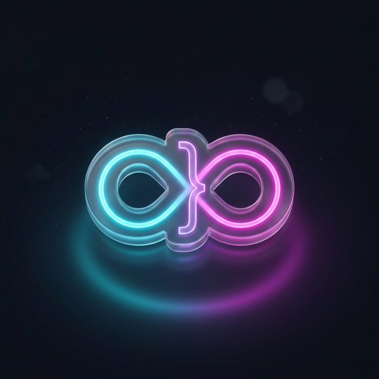
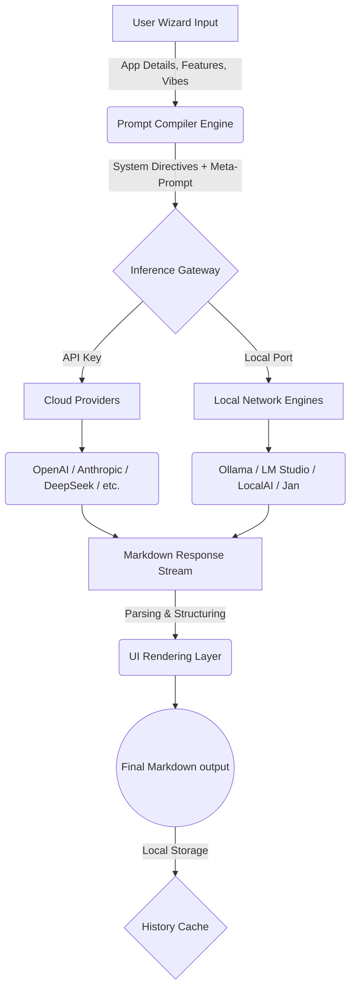
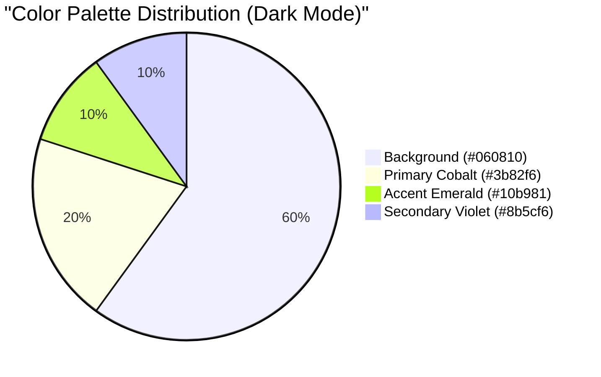

<div align="center">
  
  <h1>VibeSync</h1>
  <p><strong>Intelligent Prompt Generator for AI-Powered Creations</strong></p>
  <p>
    
    
    
  </p>
</div>

---

## 🚀 Overview

**VibeSync** is a hyper-advanced, web-based intelligence hub designed specifically to generate god-level, highly structured project prompts for AI coding agents like **Cursor**, **Bolt.new**, **Windsurf**, and **v0**.

Built entirely offline-first with zero-knowledge, local storage architecture, VibeSync connects seamlessly to **16+ Cloud AI Providers** (OpenAI, Anthropic, Gemini, DeepSeek, etc.) AND seamlessly bridges directly to **Local HTTP AI engines** like Ollama, LM Studio, Jan, and LocalAI.

Never write a prompt from scratch again.

---

## ✨ Key Features

- **⚡ Beast Mode Generation:** Takes 8 core inputs (App Name, Role, Goal, Features, Theme, etc.) and synthesizes a massive, deeply detailed PRD (Product Requirements Document) in seconds.
- **🔐 Absolute Privacy:** No database, no backend, no signups. Your API Keys and connection endpoints never leave your browser (`localStorage` strictly).
- **🌗 Liquid Light/Dark Mode:** Completely custom UI engine. Gorgeous dark glassmorphism or a pristine Off-White Light Mode accented by dynamic neon glows.
- **🖥️ 16+ API Providers Supported:** Out-of-the-box integration for Anthropic, OpenAI, DeepSeek, Mistral, xAI, OpenRouter, and more.
- **🧠 100% Free Local AI Ready:** Built-in connection layers for local inference tools like Ollama and LM Studio — no API Keys required!
- **📜 Local Blueprint History:** Automatically caches your past 20 prompts into an intelligent, animated side panel.

---

## 🏗️ System Architecture & Workflow

The internal pipeline takes simple user forms and compiles them through a deterministic structured meta-prompt before dispatching it to the currently active Neural Engine.



---

## 💻 Tech Stack & Dependencies

*   [**React 18**](https://react.dev/) – Component architecture and reactive UI engine.
*   [**Vite**](https://vitejs.dev/) – Blazing fast HMR and optimized building.
*   [**Framer Motion**](https://www.framer.com/motion/) – Liquid smooth physics-based animations, layout transitions, and interactive visual feedback.
*   [**Lucide React**](https://lucide.dev/) – Sleek, consistent vector iconography.
*   [**Vanilla CSS**](/) – Deeply customized, modular CSS grid engine utilizing dynamic CSS variables for structural theming.

---

## ⚙️ Installation & Setup

You can run VibeSync completely locally.

### 1. Clone the Repository
```bash
git clone https://github.com/cpjet64/vibecoding.git
cd vibecoding
```

### 2. Install Dependencies
```bash
npm install
```

### 3. Start the Dev Server
```bash
npm run dev
```
Navigate to `http://localhost:5173/` and start creating.

---

## 🤖 Connecting Local AI (Ollama Example)

To use VibeSync completely for free with no cloud keys:
1. Download [Ollama](https://ollama.com/) and install it on your machine.
2. Open your terminal and pull a model:
```bash
ollama pull llama3.2
```
3. Start the Ollama server:
```bash
ollama serve
```
4. Open VibeSync, navigate to **Setup AI Hub**, click on the **Local AI** tab, and enter `http://localhost:11434/v1/chat/completions` for the Ollama block.
5. Click **Test Configuration**, and if successful, you are ready to generate offline!

---

## 🎨 Design System

VibeSync uses a totally bespoke CSS framework that injects dynamic `<style>` variables depending on the active theme.



*   **Dark Mode:** Futuristic deep space background with neon glass styling.
*   **Light Mode:** Professional `#f8f9fa` Off-White backdrop offset with intelligent, soft blue gradient shadows.

---

## 🤝 Contributing

Contributions make the open-source community an incredible place. Any contributions you make are **greatly appreciated**.

1. Fork the Project
2. Create your Feature Branch (`git checkout -b feature/AmazingFeature`)
3. Commit your Changes (`git commit -m 'Add some AmazingFeature'`)
4. Push to the Branch (`git push origin feature/AmazingFeature`)
5. Open a Pull Request

---

<div align="center">
  Built with ❤️ for AI Engineers and prompt-designers worldwide.<br/>
  <strong>Stay focused. Keep shipping.</strong>
</div>
